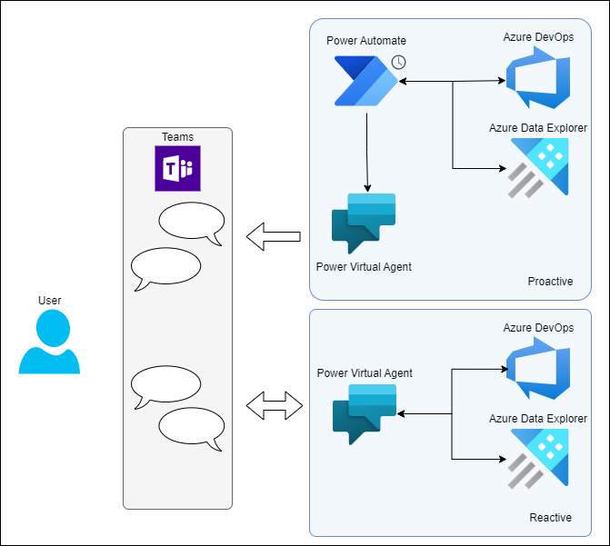
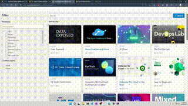
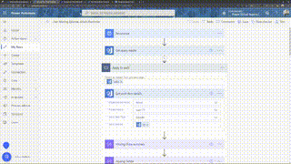

# BitBot
**BitBot** is a "low code" chatbot developed to help [@LearnTV](https://twitter.com/learntv) stakeholders boost productivity, information access, and knowledge sharing.

## Architecture Diagram

## Helpful resources

- [Learn: Get started with Power Automate](https://docs.microsoft.com/en-us/learn/modules/get-started-flows/)
- [Learn: Create bots with Power Virtual Agents](https://docs.microsoft.com/en-us/learn/paths/work-power-virtual-agents/)
- [Intro to Tech Skills at Microsoft Build 2022 Repo](https://github.com/microsoft/AcademicContent/tree/main/microsoft-conferences/2022/Build)

## Developer Relations Hackathon Team

The following folks contributed to the project

- [Frank Boucher](https://twitter.com/fboucher)
- [Jason Hand](https://twitter.com/jasonhand)
- [Ayca Bas](https://twitter.com/aycabs/)
- [Christopher Harrison](https://twitter.com/geektrainer)
- [Ruth Yakubu](https://twitter.com/ruthieyakubu)
- [Amy Boyd](https://twitter.com/AmyKateNicho)

## Video Demos - BitBot in Action

## Video Demos - How to create a pro-active chat-bot using Power Automate

